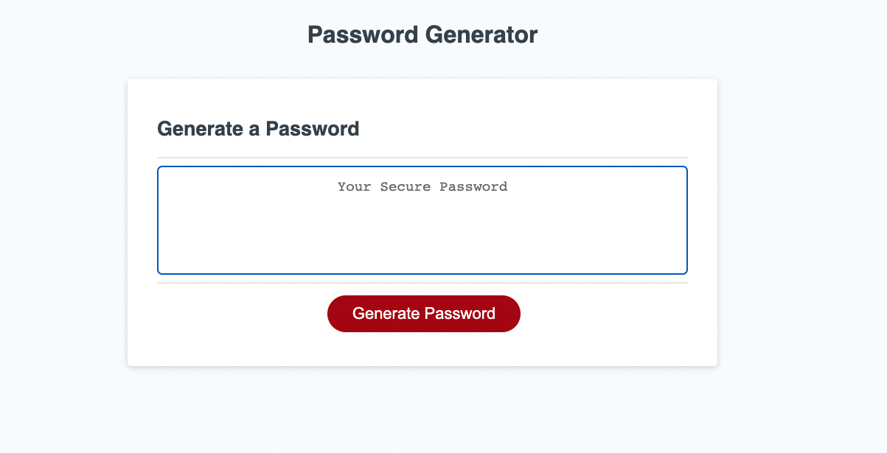

# password-generator

## Description

In this project I've used JavaScript to create the logic for a password generator.

- I will need 4 arrarys to store the information(one for uppercase, one for lowercase, one for numbers, and one for charactors).

- I used the confrim method to gather the criteria for the generator. 
 

## Credits

https://github.com/MiltonTal 